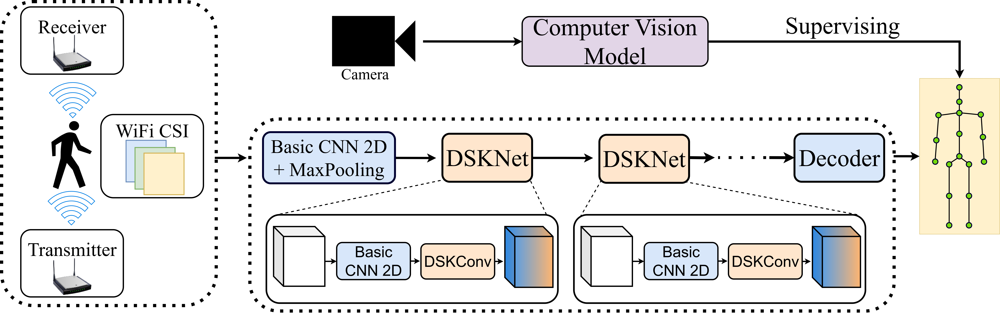
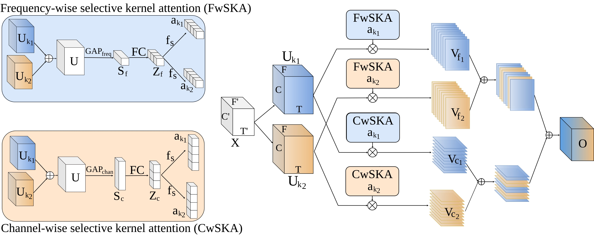
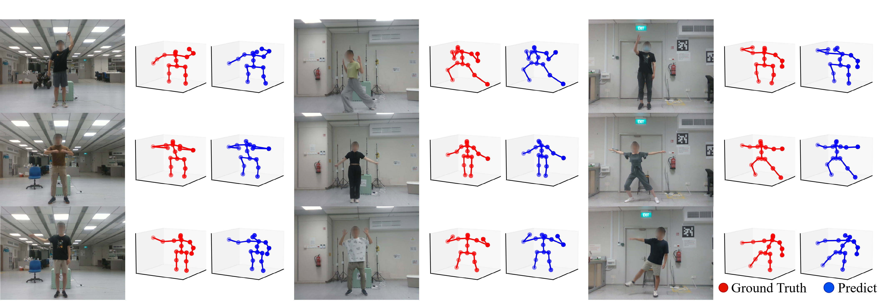

# HPE-Li 
This repo is the official implementation for [HPE-Li: WiFi-enabled Lightweight Dual Selective Kernel Convolution for Human Pose Estimation](https://www.ecva.net/papers/eccv_2024/papers_ECCV/papers/04496.pdf), which was published at ECCV 2024. And, its extension was published in the TAI journal, named HPE-Li++. This repository allows researchers and practitioners to reproduce our results on MM-Fi and WiPose datasets.

## HPE-Li Framework



## DSK Convolution



## Data Preparation
### Download datasets.

#### There are 2 datasets to download:

- MM-Fi Dataset
- WiPose Dataset

#### MM-Fi Dataset

1. Request dataset [here](https://ntu-aiot-lab.github.io/mm-fi)
2. Download the WiFi datasets:
   1. `MMFI_Dataset.zip`
   2. `MMFI_action_segments.csv`
3. Unzip all files from `MMFI_Dataset.zip` to `./data/mmfi/dataset` following directory structure:

```
- data/
  - mmfi/
    - dataset/
      - E01/
        - S01/
          - A01/
            - rgb/
            - mmwave/
            - wifi-csi/
              ...
```

#### WiPose Dataset

1. Request dataset [here](https://github.com/NjtechCVLab/Wi-PoseDataset)
2. Unzip all files from `Wi-Pose.rar` to `./data/wipose/` following directory structure:

```
- data/
  - wipose/
    - Train/
    - Test/
              ...
```

#### Person-in-WiFi-3D Dataset (New Dataset)

1. Request dataset [here](https://aiotgroup.github.io/Person-in-WiFi-3D/)
2. Unzip all files from `wifipose_dataset.zip` to `./data/person_in_wifi_3d/` following directory structure:

```
- data/
  - person_in_wifi_3d/
    - train_data/
    - test_data/
```

## Run Simulations

### MM-Fi dataset
```
python att_mmfi.py 
```

### WiPose dataset

```
python att_wipose.py
```
### Check Complexity

```
python complexity.py
```
### Using Denoiser

```
python denoiser_training.py
```
## Visualization 



## Acknowledgements

This repo is based on [MetaFi++](https://github.com/pridy999/metafi_pose_estimation). The data processing is borrowed from [MM-Fi](https://github.com/ybhbingo/MMFi_dataset) and [WiPose](https://github.com/NjtechCVLab/Wi-PoseDataset).

Thanks to the original authors for their work!


## Citation

Please cite this work if you find it useful.

```
@inproceedings{d2024hpe,
  title={Hpe-li: Wifi-enabled lightweight dual selective kernel convolution for human pose estimation},
  author={D. Gian, Toan and Dac Lai, Tien and Van Luong, Thien and Wong, Kok-Seng and Nguyen, Van-Dinh},
  booktitle={European Conference on Computer Vision},
  pages={93--111},
  year={2024},
  organization={Springer}
}
```


